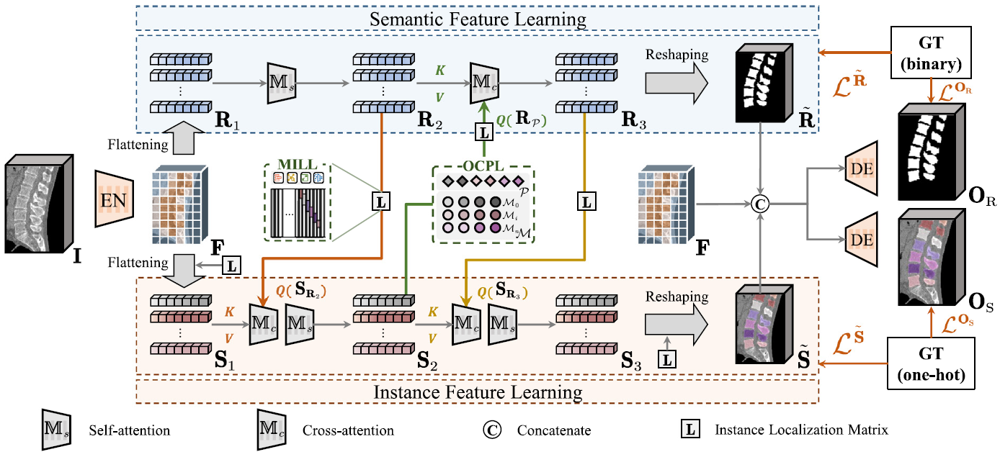

# Semantics and Instance Interactive Learning for Labeling and Segmentation of Vertebrae in CT Images  

[**Link to the Paper**](https://www.sciencedirect.com/science/article/abs/pii/S1361841524003050)  

---

## Framework  



---

## Contributions  

The main contributions of this paper are as follows:  

1. **New Learning Paradigm**  
   We introduce a new paradigm based on semantics and instance interactive learning, namely **SIIL**, for synchronous labeling and segmentation of vertebrae in CT images. Feature interaction helps learn positional and contour information, improving the separability of vertebral instances.  

2. **MILL Module**  
   We propose the **MILL** module to facilitate interaction between semantic and instance features. This module introduces an instance localization matrix to filter out absent vertebrae and reduce interference.  

3. **OCPL Module**  
   We design the **OCPL** module to mitigate the high similarity of adjacent vertebrae by modeling the intrinsic sequential relationship of instance features via **Bi-GRU**. It enhances inter-class separability and intra-class consistency through cross-image contrastive learning.  

4. **Extensive Experiments**  
   We conduct comprehensive experiments to demonstrate the effectiveness of the proposed method, achieving optimal performance on three public datasets.  

---

## Data Organization  

Below is the recommended structure for organizing your data:  

```plaintext
Project/  
│  
├── data/  
│   ├── img/  
│   │   ├── 1_3_6_1_4_1_9328_50_4_0001.nii.gz
│   │   └── ...
│   ├── msk/  
│   │   ├── 1_3_6_1_4_1_9328_50_4_0001.nii.gz 
│   │   └── ...
│   ├── pap/  
│   │   ├── 1_3_6_1_4_1_9328_50_4_0001.nii.gz 
│   │   └── ...
│   ├── training.txt
│   └── testing.txt
└── SIIL/...
```

---

### File Descriptions  

- **`data/img`**: Directory containing processed image data in `.nii.gz` format.  
- **`data/msk`**: Directory containing processed mask data in `.nii.gz` format.
- **`data/pap`**: Directory containing processed probability map in `.nii.gz` format. (only used for training)  
- **`training.txt`**: A text file containing patient names used for the training data.  
- **`testing.txt`**: A text file containing patient names used for the testing data.

---

## Code Execution Steps

Preprocess the data and organize files according to the **Data Organization** section.

Install the dependencies:  
   ```bash  
   conda install -c conda-forge --file requirements.txt
   ```
Train the model:
   ```bash  
   python SIIL.trainer.py  
   ```
Test the model:
   ```bash  
   python SIIL.tester.py  
   ```
To modify parameters, edit the file:  **`SIIL.get_config.py`**
